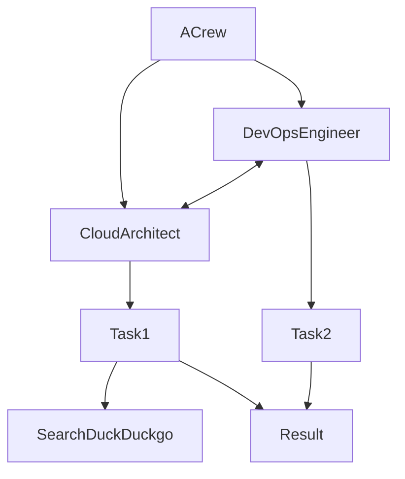

# creaw-ollama-agent

:exclamation: experiment

## description

Create a CloudArchitect Agent and DevOps engineer
A Cloud Architect and a DevOPs engineer finding solutions on running kubernetes in the cloud.


# setup ollama

```sh
ollama run codellama
```

## make setup

```sh
sudo apt install pipenv
pipenv install jupyterlab 'crewai[tools]' langchain-community duckduckgo-search
```

## run

 --> `Ipython Notebook` or python `mycrew.py`



